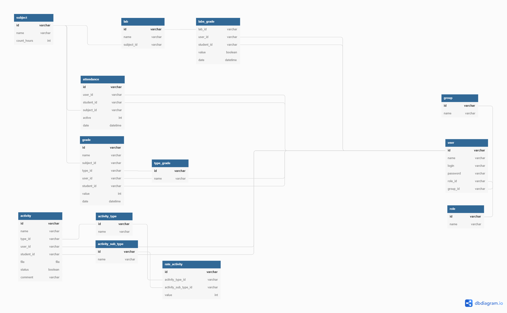

# flaskProject
Point rating system USATU
## database scheme

## Create environment
```
    py -3 -m venv venv
```
## Activate the environment
```
    venv\Scripts\activate
```
## Installation
###Windows
```
    pip install Flask
    pip install -U Flask-SQLAlchemy
```
##quick start
```
    set FLASK_APP=app.py
    set FLASK_ENV=development
    py -m flask run
```